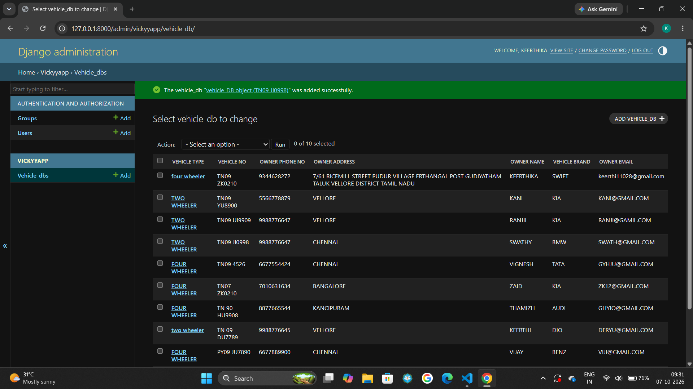

# Ex02 Django ORM Web Application
## Date: 07/10/2026

## AIM
To develop a Django Application to store and retrieve data from a Vehicle Service Database platform using Object Relational Mapping(ORM).


## DESIGN STEPS

### STEP 1:
Clone the problem from GitHub

### STEP 2:
Create a new app in Django project

### STEP 3:
Enter the code for admin.py and models.py

### STEP 4:
Detect changes and create migration files that describe how to modify the database schema

### STEP 5:
Execute the migration files and update the database schema to match your Django models

### STEP 6:
Create a superuser with full access rights to all models and data through the admin interface.

### STEP 7:
Apply the migration files of the created app to the database

### STEP 8:
Execute Django admin using localhost and create details for 10 entries

## PROGRAM
```
MODELS.PY
from django.db import models
from django.contrib import admin
class vehicle_DB(models.Model):
    vehicle_type=models.TextField()
    vehicle_no=models.CharField(max_length=15,primary_key=True)
    owner_phone_no=models.IntegerField()
    owner_address=models.TextField()
    owner_name=models.CharField(max_length=11)
    vehicle_brand=models.CharField(max_length=12)
    owner_email=models.EmailField()
class vehicle_DBAdmin(admin.ModelAdmin):
    list_display=["vehicle_type","vehicle_no","owner_phone_no","owner_address","owner_name","vehicle_brand","owner_email"]


ADMIN.PY
from django.contrib import admin
from.models import(vehicle_DB,vehicle_DBAdmin)
admin.site.register(vehicle_DB,vehicle_DBAdmin)


```


## OUTPUT



## RESULT
Thus the program for creating Online Food Delivery Database using ORM hass been executed successfully
